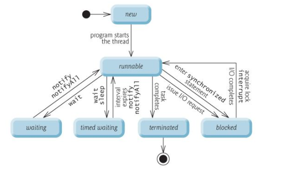

## Java进阶问题

### 1. 观察者模式

- 观察者模式中，一个被观察者管理所有相依于它的观察者物件，并且在本身的状态改变时主动发出通知。这通常通过呼叫各观察者所提供的方法来实现。此种模式通常被用来实现事件处理系统。

例子说明: 珠宝商运送一批钻石，有黄金强盗准备抢劫，珠宝商雇佣了私人保镖，于是当运输车上路的时候，强盗保镖都要观察运输车一举一动

- 抽象的观察者

  ```java
  public interface Watcher {
      public void update();
  }
  ```

- 抽象的被观察者

  ```java
  public interface Watched {
      public void addWatcher(Watcher watcher);	//添加观察者
    	public void removeWatcher(Watcher watcher);	//移除观察者
    	public void notifyWatchers();	//通知观察者
  }
  ```

- 具体的观察者

  保镖

  ```java
  public class Security implements Watcher {
      @Override
    	public void update() {
          System.out.println("运输车有行动，报表贴身保护");
      }
  }
  ```

  强盗

  ```java
  public class Thief implements Watcher {
      @Override
    	public void update() {
          System.out.println("运输车有行动，强盗准备动手");
      }
  }
  ```

- 具体的被观察者

  ```java
  public class Transporter implements Watched {
      private List<Watcher> list = new ArrayList<Watcher>();
    	
    	@Override
    	public void addWatcher(Watcher watcher) {
          list.add(watcher);
      }
    
    	@Override
    	public void removeWatcher(Watcher watcher) {
          list.remove(watcher);
      }
    
    	@Override
    	public void notifyWatchers() {
          for(Watcher watcher : list) {
              watcher.update();
          }
      }
  }
  ```

- 测试类

  ```java
  public class Test {
      public static void main(String[] args) {
          Transporter transporter = new Transporter();
        	
        	Security security = new Security();
        	Thief thief = new thief();
        	
        	//添加观察者
        	transporter.addWatcher(security);
        	transporter.addWatcher(thief);
        	
        	//通知观察者
        	transporter.notifyWatchers();
      }
  }
  ```


### 2. Java回调函数

- 回调: A类中调用B类中的某个方法C，然后B类的C方法反过来调用A类中的方法D，D这个方法就叫回调方法

  - Class A实现接口CallBack
  - class A中包含一个class B的引用b
  - class B有一个参数为CallBack的方法f(CallBack callback)
  - A的对象a调用B的方法 f(CallBack callback)
  - 然后b就可以在f(CallBack callback)方法中调用A的方法

- 示例:

  回调接口

  ```java
  public interface CallBack {
      public void testCallBack();
  }
  ```

  Class A

  ```java
  public class A implements CallBack {
    	//持有B的引用
      private B b;
    
    	public A(B b) {
          this.b = b;
      }
    
    	//在此方法中调用B的方法f
    	public void askB() {
        	//使用一个线程，即为异步回调
          new Thread(new Runnable() {
            	@Override
              public void run() {
                  b.f(A.this)
              }
          }).start();
      }
    
    	@Override
    	public void testCallBack() {
          System.out.println("CallBack");
      }
  }
  ```

  Class B

  ```java
  public Class B {
      public void f(CallBack callBack) {
          System.out.println("现在回调");
        	//调用回调方法
        	callBack.testCallBack();
      }
  }
  ```

  测试类

  ```java
  public class Test {
      public static void main(String[] args) {
          B b = new B();
        	A a = new A(b);
        	a.askB();
      }
  }
  ```


### 3. Java 关键字volatile 与 synchronized 作用与区别？

- volatile: 它所修饰的变量不保留拷贝，直接访问主内存中的
  - 在Java内存模型中，有main memory，每个线程也有自己的memory (例如寄存器)。为了性能，一个线程会在自己的memory中保持要访问的变量的副本。这样就会出现同一个变量在某个瞬间，在一个线程的memory中的值可能与另外一个线程memory中的值，或者main memory中的值不一致的情况。 一个变量声明为volatile，就意味着这个变量是随时会被其他线程修改的，因此不能将它cache在线程memory中
- synchronized: 当它用来修饰一个方法或者一个代码块的时候，能够保证在同一时刻最多只有一个线程执行该段代码
  - synchronized通过锁定和解锁某个监视器同步所有变量的值。显然synchronized要比volatile消耗更多资源。


### 4. 有哪些不同的线程生命周期？

- 当在Java程序中新建一个线程时，它的状态是New。当调用线程的start()方法时，状态被改变为Runnable。线程调度器会为Runnable线程池中的线程分配CPU时间并且讲它们的状态改变为Running。其他的线程状态还有Waiting，Blocked和Dead

  

### 5. 你对线程优先级的理解是什么？ 

- 一般来说，高优先级的线程在运行时会具有优先权，但这依赖于线程调度的实现，这个实现是和操作系统相关的(OSdependent)。可以定义线程的优先级，但是这并不能保证高优先级的线程会在低优先级的线程前执行。线程优先级是一个int变量(从1-10)，1代表最低优先级，10代表最高优先级


### 6. 什么是线程安全？Vector是一个线程安全类吗？ 

- 线程安全就是说多线程访问同一代码，不会产生不确定的结果。编写线程安全的代码是低依靠线程同步
- Vector里一些写删操作的方法都是用synchronized实现同步，尽管vector中的contains()方法和 add()方法都是同步的。但是组合应用时还是存在现场安全问题

### 7. Java开发中，什么是死锁(Deadlock)？如何分析和避免死锁？

- 两个进程都在等待对方执行完毕才能继续往下执行的时候就发生了死锁。结果就是两个进程都陷入了无限的等待中。
- 使用synchronized关键字可以避免死锁

### 8. Java中的泛型是什么 ? 使用泛型的好处是什么?

- 类型安全 泛型的主要目标是实现java的类型安全。 泛型可以使编译器知道一个对象的限定类型是什么，这样编译器就可以在一个高的程度上验证这个类型
- 消除了强制类型转换 使得代码可读性好，减少了很多出错的机会
- Java语言引入泛型的好处是安全简单。泛型的好处是在编译的时候检查类型安全，并且所有的强制转换都是自动和隐式的，提高代码的重用率。
- ​